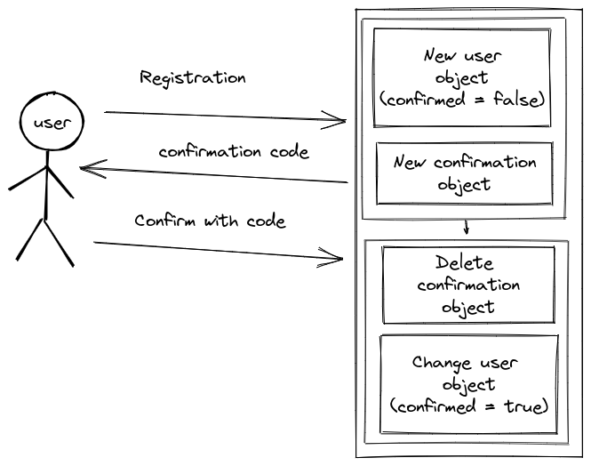

# Реализуйте сервис, который подтверждает аккаунт пользователя по смс-коду или email:

Для запуска необходимо воспользоваться командой `make run`.

Логика работы организована согласно схеме 




1. пользователь регистрируется;
   В хранилище создаются 2 объекта: `user ` и `confirmation`, ключом является имя пользователя.

    Пример команды для создания пользователя.

   ```bash
    curl -X POST localhost:8080 -H "Content-Type: application/json" -d '{"name":"username","password":"password"}'
    # 642
   ```

2. ему приходит уведомление с кодом на телефон или почту;
    
    После отправки кода:

    _Пример отправки кода_:
    ```bash
    curl -X POST localhost:8080/username/confirm -d "code=642"'
    ```
Для хранения данных используется redis.